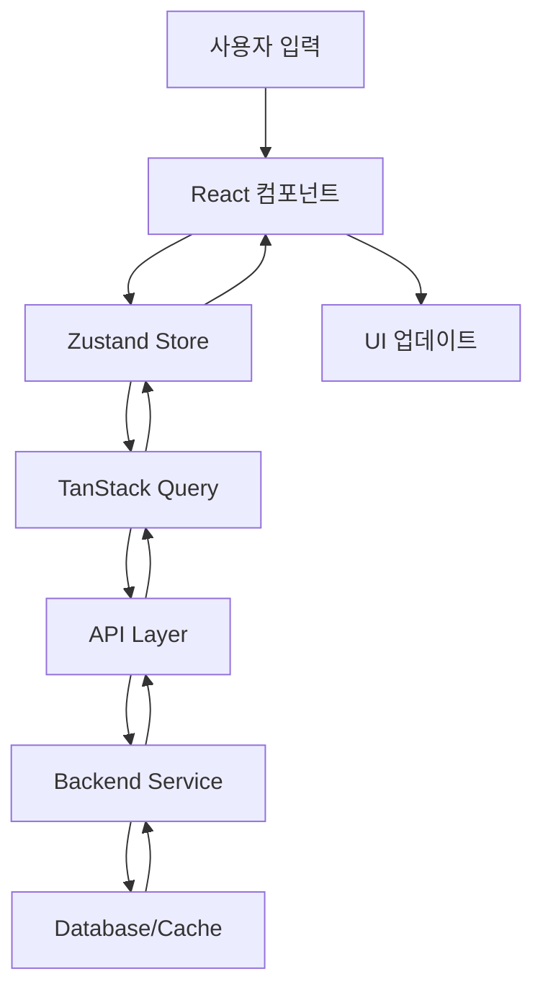

# 시간표 마법사 (Schedule Wizard) - Product Requirements Document

## 1. 기능 요구사항 (Functional Requirements)

### 1.1 핵심 기능

#### 과목 검색 및 필터링 기능
- **실시간 검색**: 과목명, 교수명, 과목코드로 검색
- **고급 필터링**: 
  - 학과별 필터
  - 학년별 필터 (1학년, 2학년, 3학년, 4학년)
  - 시간대별 필터 (오전, 오후, 저녁)
  - 요일별 필터 (월, 화, 수, 목, 금, 토)
  - 학점별 필터 (1학점, 2학점, 3학점 등)
  - 강의실별 필터
- **정렬 기능**: 과목명, 시간, 학점, 교수명 순으로 정렬

#### 시간표 그룹별 관리
- **다중 시간표 생성**: 최대 10개까지 시간표 그룹 생성 가능
- **그룹별 네이밍**: 사용자 정의 그룹명 설정 (예: "이상적인 시간표", "실용적인 시간표")
- **그룹 간 비교**: 여러 그룹을 동시에 비교 가능한 UI
- **그룹별 통계**: 총 학점, 주간 수업 시간, 공강 시간 계산

#### 과목 추가/삭제 기능
- **드래그 앤 드롭**: 검색 결과에서 시간표로 직접 드래그
- **원클릭 추가**: 검색 결과에서 '+' 버튼으로 빠른 추가
- **일괄 삭제**: 선택한 여러 과목 동시 삭제
- **임시 저장**: 장바구니 형태의 임시 과목 저장소

#### 시간 충돌 감지 및 알림
- **실시간 충돌 감지**: 과목 추가 시 즉시 충돌 확인
- **시각적 표시**: 충돌 과목 빨간색으로 하이라이트
- **충돌 해결 제안**: 대체 가능한 분반이나 시간대 제안
- **경고 모달**: 충돌 상세 정보와 해결 방안 제시

#### 시각적 시간표 캘린더 뷰
- **주간 캘린더**: 월~토 7일 시간표 뷰
- **시간대 표시**: 1교시~10교시 또는 09:00~21:00 형태
- **색상 구분**: 전공/교양/기타 과목별 색상 구분
- **반응형 레이아웃**: 데스크톱/태블릿/모바일 최적화

#### 과목별 상세 정보 표시
- **기본 정보**: 과목코드, 과목명, 분반, 학점, 교수명
- **시간 정보**: 요일, 교시, 강의실
- **추가 정보**: 수강 정원, 현재 신청 인원, 대기자 수
- **강의계획서**: 강의 목표, 평가 방법, 교재 정보
- **수강평**: 이전 학기 수강생 평가 (별점, 리뷰)

#### 시간표 저장 및 불러오기
- **로컬 저장**: 브라우저 로컬 스토리지 활용
- **클라우드 동기화**: 계정 연동 시 여러 기기 간 동기화
- **내보내기**: PNG, PDF, Excel 형태로 내보내기
- **공유하기**: SNS, 카카오톡으로 시간표 공유

#### 반응형 디자인
- **모바일 퍼스트**: 모바일에서도 완전한 기능 제공
- **터치 최적화**: 드래그 앤 드롭, 스와이프 제스처 지원
- **접근성**: WCAG 2.1 AA 레벨 준수

### 1.2 부가 기능

#### 스마트 추천 시스템
- **AI 기반 추천**: 전공, 학년, 관심사 기반 과목 추천
- **시간 최적화**: 공강 시간 최소화 또는 특정 요일 비우기
- **졸업 요건 체크**: 필수 교양, 전공 필수 과목 이수 확인

#### 소셜 기능
- **친구 시간표**: 친구들과 시간표 공유 및 비교
- **스터디 그룹**: 같은 과목 수강생 매칭
- **시간표 투표**: 여러 후보 중 최적 시간표 선택

## 2. 기술 스택 (Technology Stack)

### 2.1 프론트엔드

#### 프레임워크 & 언어
- **React 18.2+** with TypeScript
  - 컴포넌트 재사용성과 타입 안전성 확보
  - 풍부한 생태계와 커뮤니티 지원
- **Next.js 14+** (App Router)
  - SSR/SSG로 SEO 최적화
  - 자동 코드 스플리팅
  - API Routes 활용

#### 상태 관리
- **Zustand** (메인 상태 관리)
  - 경량화된 상태 관리
  - TypeScript 완벽 지원
  - 간단한 러닝 커브
- **TanStack Query** (서버 상태)
  - 캐싱 및 동기화
  - 백그라운드 리프레시

#### UI/UX 라이브러리
- **Tailwind CSS 3.4+**
  - 빠른 스타일링
  - 일관된 디자인 시스템
- **Shadcn/ui + Radix UI**
  - 접근성 최적화
  - 커스터마이징 용이
- **Framer Motion**
  - 부드러운 애니메이션
  - 드래그 앤 드롭 구현

#### 추가 라이브러리
- **React Hook Form** + **Zod**: 폼 검증
- **date-fns**: 날짜/시간 처리
- **React Beautiful DnD**: 드래그 앤 드롭
- **Lucide React**: 아이콘

### 2.2 백엔드

#### 프레임워크
- **Node.js** + **Express.js**
  - JavaScript 풀스택 개발
  - 빠른 프로토타이핑
- **Prisma ORM**
  - 타입 안전 데이터베이스 조작
  - 자동 마이그레이션

#### 데이터베이스
- **PostgreSQL** (메인 DB)
  - 관계형 데이터 모델링
  - 복잡한 쿼리 지원
- **Redis** (캐시/세션)
  - 빠른 응답 속도
  - 세션 관리

### 2.3 배포 & 인프라
- **Vercel** (프론트엔드)
- **Railway** or **PlanetScale** (데이터베이스)
- **Upstash** (Redis)

## 3. 아키텍처 설계

### 3.1 컴포넌트 구조도

```
src/
├── app/                    # Next.js App Router
│   ├── (dashboard)/       # 메인 대시보드
│   ├── search/           # 과목 검색
│   ├── schedule/         # 시간표 관리
│   └── api/             # API Routes
├── components/
│   ├── ui/              # 재사용 UI 컴포넌트
│   ├── schedule/        # 시간표 관련 컴포넌트
│   ├── search/          # 검색 관련 컴포넌트
│   └── common/          # 공통 컴포넌트
├── lib/
│   ├── store/           # Zustand 스토어
│   ├── hooks/           # 커스텀 훅
│   ├── utils/           # 유틸리티 함수
│   └── types/           # TypeScript 타입 정의
└── styles/              # 전역 스타일
```

### 3.2 데이터 플로우



### 3.3 API 엔드포인트 설계

#### 과목 관련 API
```
GET /api/courses              # 전체 과목 조회
GET /api/courses/search       # 과목 검색
GET /api/courses/:id          # 특정 과목 상세 조회
GET /api/courses/:id/reviews  # 과목 수강평 조회
```

#### 시간표 관련 API
```
GET /api/schedules           # 사용자 시간표 목록
POST /api/schedules          # 새 시간표 생성
GET /api/schedules/:id       # 특정 시간표 조회
PUT /api/schedules/:id       # 시간표 수정
DELETE /api/schedules/:id    # 시간표 삭제
POST /api/schedules/:id/courses  # 과목 추가
DELETE /api/schedules/:id/courses/:courseId  # 과목 삭제
```

#### 사용자 관련 API
```
GET /api/user/profile        # 사용자 프로필
PUT /api/user/profile        # 프로필 수정
GET /api/user/preferences    # 사용자 설정
PUT /api/user/preferences    # 설정 수정
```

### 3.4 데이터베이스 스키마

```sql
-- 사용자 테이블
CREATE TABLE users (
    id SERIAL PRIMARY KEY,
    email VARCHAR(255) UNIQUE NOT NULL,
    name VARCHAR(100) NOT NULL,
    student_id VARCHAR(20),
    department VARCHAR(100),
    grade INTEGER,
    created_at TIMESTAMP DEFAULT NOW(),
    updated_at TIMESTAMP DEFAULT NOW()
);

-- 과목 테이블
CREATE TABLE courses (
    id SERIAL PRIMARY KEY,
    course_code VARCHAR(20) NOT NULL,
    course_name VARCHAR(200) NOT NULL,
    section VARCHAR(10),
    professor VARCHAR(100),
    credits INTEGER NOT NULL,
    department VARCHAR(100),
    grade_level INTEGER,
    max_students INTEGER,
    current_students INTEGER DEFAULT 0,
    room VARCHAR(50),
    semester VARCHAR(10) NOT NULL,
    year INTEGER NOT NULL,
    created_at TIMESTAMP DEFAULT NOW()
);

-- 시간 정보 테이블
CREATE TABLE course_times (
    id SERIAL PRIMARY KEY,
    course_id INTEGER REFERENCES courses(id),
    day_of_week INTEGER NOT NULL, -- 1=월, 2=화, ..., 6=토
    start_time TIME NOT NULL,
    end_time TIME NOT NULL,
    room VARCHAR(50)
);

-- 시간표 테이블
CREATE TABLE schedules (
    id SERIAL PRIMARY KEY,
    user_id INTEGER REFERENCES users(id),
    name VARCHAR(100) NOT NULL,
    semester VARCHAR(10) NOT NULL,
    year INTEGER NOT NULL,
    is_active BOOLEAN DEFAULT false,
    created_at TIMESTAMP DEFAULT NOW(),
    updated_at TIMESTAMP DEFAULT NOW()
);

-- 시간표-과목 연결 테이블
CREATE TABLE schedule_courses (
    id SERIAL PRIMARY KEY,
    schedule_id INTEGER REFERENCES schedules(id),
    course_id INTEGER REFERENCES courses(id),
    added_at TIMESTAMP DEFAULT NOW(),
    UNIQUE(schedule_id, course_id)
);

-- 수강평 테이블
CREATE TABLE course_reviews (
    id SERIAL PRIMARY KEY,
    course_id INTEGER REFERENCES courses(id),
    user_id INTEGER REFERENCES users(id),
    rating INTEGER CHECK (rating >= 1 AND rating <= 5),
    comment TEXT,
    semester VARCHAR(10) NOT NULL,
    year INTEGER NOT NULL,
    created_at TIMESTAMP DEFAULT NOW()
);
```

## 4. 사용자 경험 (UX) 설계

### 4.1 사용자 플로우

#### 신규 사용자 온보딩
1. 회원가입/로그인
2. 프로필 설정 (학과, 학년, 관심사)
3. 튜토리얼 (주요 기능 소개)
4. 첫 시간표 생성

#### 시간표 작성 플로우
1. 시간표 그룹 생성
2. 과목 검색 → 필터링 → 정렬
3. 과목 선택 → 시간표에 추가
4. 충돌 확인 → 해결
5. 저장 및 미리보기

#### 과목 검색 플로우
1. 검색어 입력 (실시간 자동완성)
2. 필터 적용 (학과, 시간대, 교수 등)
3. 결과 리스트 확인
4. 과목 상세 정보 조회
5. 시간표에 추가 또는 관심 목록 저장

### 4.2 와이어프레임 구조

#### 메인 대시보드 (Desktop)
```
┌─────────────────────────────────────────────────────────────┐
│ Header: 로고 | 메뉴 | 프로필                                    │
├─────────────────────────────────────────────────────────────┤
│ Sidebar (250px)    │ Main Content Area (1000px+)            │
│ - 시간표 그룹       │ ┌───────────────────────────────────────┐│
│   • 그룹 1 ★       │ │ 시간표 캘린더 뷰                       ││
│   • 그룹 2         │ │ ┌─────┬─────┬─────┬─────┬─────┬─────┐ ││
│   • 그룹 3         │ │ │ 시간 │ 월   │ 화   │ 수   │ 목   │ 금   │ ││
│ - 빠른 메뉴        │ │ ├─────┼─────┼─────┼─────┼─────┼─────┤ ││
│   • 과목 검색      │ │ │ 9-10│     │수학  │     │수학  │     │ ││
│   • 졸업요건       │ │ │10-11│영어  │     │     │     │영어  │ ││
│   • 설정          │ │ └─────┴─────┴─────┴─────┴─────┴─────┘ ││
│                   │ └───────────────────────────────────────┘│
│                   │ 시간표 통계: 총 15학점, 주 12시간          │
└─────────────────────────────────────────────────────────────┘
```

#### 과목 검색 페이지
```
┌─────────────────────────────────────────────────────────────┐
│ 검색바: [과목명, 교수명 검색...] [고급 필터 ▼] [검색]        │
├─────────────────────────────────────────────────────────────┤
│ 필터 패널 (접을 수 있음)                                      │
│ 학과: [전체▼] 학년: [전체▼] 시간: [전체▼] 학점: [전체▼]      │
├─────────────────────────────────────────────────────────────┤
│ 검색 결과 (카드 형태)                                        │
│ ┌─────────────────────────────────────────────────────────┐ │
│ │ [CS101] 컴퓨터과학입문 (3학점)              [+ 추가] │ │
│ │ 교수: 김교수 | 시간: 월수 9-10교시 | 정원: 30/50     │ │
│ │ 평점: ★★★★☆ (4.2) | 강의실: 공학관 301          │ │
│ └─────────────────────────────────────────────────────────┘ │
└─────────────────────────────────────────────────────────────┘
```

### 4.3 인터랙션 디자인

#### 핵심 인터랙션
1. **드래그 앤 드롭**: 검색 결과 → 시간표 캘린더
2. **호버 효과**: 과목 카드 호버 시 상세 정보 표시
3. **모달 팝업**: 과목 상세 정보, 충돌 경고, 설정
4. **토스트 알림**: 성공/실패 메시지, 자동 저장 상태
5. **로딩 상태**: 스켈레톤 UI, 프로그레스 바

#### 모바일 최적화
1. **스와이프 제스처**: 시간표 그룹 간 전환
2. **터치 친화적**: 버튼 최소 44px 크기
3. **Bottom Sheet**: 과목 상세 정보, 필터 옵션
4. **Sticky Header**: 검색바 고정

## 5. 개발 단계별 계획

### 5.1 MVP (Minimum Viable Product) 기능 정의

#### Phase 1: Core Features (4주)
- [ ] 기본 시간표 캘린더 뷰
- [ ] 과목 검색 (기본 검색만)
- [ ] 과목 추가/삭제
- [ ] 시간 충돌 감지
- [ ] 로컬 저장

#### Phase 2: Essential Features (3주)
- [ ] 시간표 그룹 관리 (3개까지)
- [ ] 과목 필터링 (학과, 시간대)
- [ ] 반응형 디자인 (모바일 대응)
- [ ] 시간표 내보내기 (PNG)

#### Phase 3: Enhanced Features (4주)
- [ ] 사용자 계정 시스템
- [ ] 클라우드 동기화
- [ ] 고급 검색 필터
- [ ] 과목 상세 정보
- [ ] 드래그 앤 드롭

### 5.2 개발 우선순위

#### 높음 (P0)
1. 시간표 캘린더 UI
2. 과목 검색 API
3. 기본 CRUD 기능
4. 시간 충돌 로직

#### 중간 (P1)
1. 사용자 인증
2. 반응형 디자인
3. 데이터 동기화
4. 필터링 시스템

#### 낮음 (P2)
1. 수강평 시스템
2. 소셜 기능
3. AI 추천
4. 고급 통계

### 5.3 예상 개발 일정

```
Week 1-2:  프로젝트 셋업, 기본 UI 컴포넌트
Week 3-4:  시간표 캘린더, 과목 검색
Week 5-6:  CRUD 기능, 충돌 감지
Week 7-8:  사용자 시스템, 데이터베이스 연동
Week 9-10: 반응형 디자인, 모바일 최적화
Week 11-12: 테스트, 버그 수정, 배포
```

### 5.4 Vibe-Driven Development 가이드라인

#### 빠른 프로토타이핑
1. **컴포넌트 우선**: UI 컴포넌트부터 개발
2. **Mock Data**: 실제 API 전에 가짜 데이터로 UI 완성
3. **Hot Reloading**: Vite/Next.js 활용한 즉시 피드백
4. **Visual Testing**: Storybook으로 컴포넌트 시각화

#### 직관적인 개발 플로우
```typescript
// 1. 타입부터 정의 (계약 우선)
interface Course {
  id: string;
  name: string;
  professor: string;
  times: CourseTime[];
}

// 2. 컴포넌트 구조 설계
const ScheduleCalendar = ({ courses, onAddCourse }: Props) => {
  // 3. 로직 구현
  const handleDrop = (course: Course, timeSlot: TimeSlot) => {
    // 충돌 체크
    // 추가 로직
  };
  
  // 4. UI 렌더링
  return <CalendarGrid>{/* ... */}</CalendarGrid>;
};
```

#### 개발 속도 최적화 도구
- **Copilot/ChatGPT**: 반복 코드 생성
- **Tailwind**: 빠른 스타일링
- **Shadcn/ui**: 프로덕션 레디 컴포넌트
- **Vercel**: 원클릭 배포

## 6. 비기능 요구사항

### 6.1 성능 요구사항

#### 응답 시간
- **초기 페이지 로드**: < 2초
- **과목 검색**: < 500ms
- **시간표 업데이트**: < 200ms
- **페이지 이동**: < 300ms

#### 처리량
- **동시 사용자**: 1,000명
- **과목 데이터**: 10,000개 이상
- **검색 쿼리**: 초당 100회

#### 최적화 전략
1. **이미지 최적화**: WebP, lazy loading
2. **번들 최적화**: 코드 스플리팅, tree shaking
3. **캐싱**: Redis, CDN, 브라우저 캐시
4. **데이터베이스**: 인덱싱, 쿼리 최적화

### 6.2 보안 요구사항

#### 인증 및 인가
- **OAuth 2.0**: Google, 학교 계정 연동
- **JWT**: 토큰 기반 인증
- **RBAC**: 역할 기반 접근 제어

#### 데이터 보안
- **HTTPS**: 모든 통신 암호화
- **데이터 암호화**: 개인정보 DB 암호화
- **입력 검증**: XSS, SQL Injection 방지
- **CSRF 보호**: 토큰 기반 검증

#### 개인정보 보호
- **최소 수집**: 필요한 정보만 수집
- **동의 관리**: 쿠키, 개인정보 사용 동의
- **데이터 삭제**: 계정 삭제 시 완전 삭제

### 6.3 접근성 요구사항

#### WCAG 2.1 AA 준수
- **키보드 네비게이션**: 모든 기능 키보드로 접근
- **스크린 리더**: ARIA 레이블, 시맨틱 HTML
- **색상 대비**: 4.5:1 이상 명암비
- **확대/축소**: 200%까지 확대 지원

#### 국제화 (i18n)
- **다국어 지원**: 한국어, 영어
- **RTL 언어**: 아랍어, 히브리어 대응 준비
- **지역화**: 날짜, 시간, 숫자 형식

### 6.4 확장성 요구사항

#### 수평적 확장
- **마이크로서비스**: 기능별 서비스 분리 준비
- **로드 밸런싱**: 트래픽 분산
- **DB 샤딩**: 대용량 데이터 처리

#### 모니터링 및 관찰 가능성
- **로깅**: 구조화된 로그, 중앙 집중화
- **메트릭**: 성능, 에러율, 사용량 모니터링
- **알림**: 임계값 초과 시 자동 알림

## 7. 구현 팁 및 베스트 프랙티스

### 7.1 코드 품질
```typescript
// 좋은 예: 타입 안전성과 명확한 네이밍
interface ScheduleConflict {
  conflictingCourse: Course;
  conflictType: 'time_overlap' | 'duplicate_course';
  severity: 'warning' | 'error';
}

const detectConflicts = (
  existingCourses: Course[],
  newCourse: Course
): ScheduleConflict[] => {
  // 명확한 로직 구현
};
```

### 7.2 상태 관리 패턴
```typescript
// Zustand 스토어 예시
interface ScheduleStore {
  schedules: Schedule[];
  activeScheduleId: string;
  addCourseToSchedule: (scheduleId: string, course: Course) => void;
  removeCourseFromSchedule: (scheduleId: string, courseId: string) => void;
}

const useScheduleStore = create<ScheduleStore>((set, get) => ({
  // 상태 및 액션 구현
}));
```

### 7.3 컴포넌트 설계 원칙
1. **단일 책임**: 하나의 컴포넌트는 하나의 역할
2. **재사용성**: 프롭스를 통한 유연한 설정
3. **합성**: 작은 컴포넌트들의 조합
4. **성능**: React.memo, useMemo 적절한 사용

---

이 PRD는 한국 대학교 시간표 시스템의 특성을 반영하여 작성되었으며, 개발자가 바로 구현할 수 있는 구체적인 가이드라인을 제공합니다. 각 단계별로 점진적으로 발전시켜 나갈 수 있는 구조로 설계되어 있어, MVP부터 시작하여 완전한 서비스까지 확장 가능합니다.